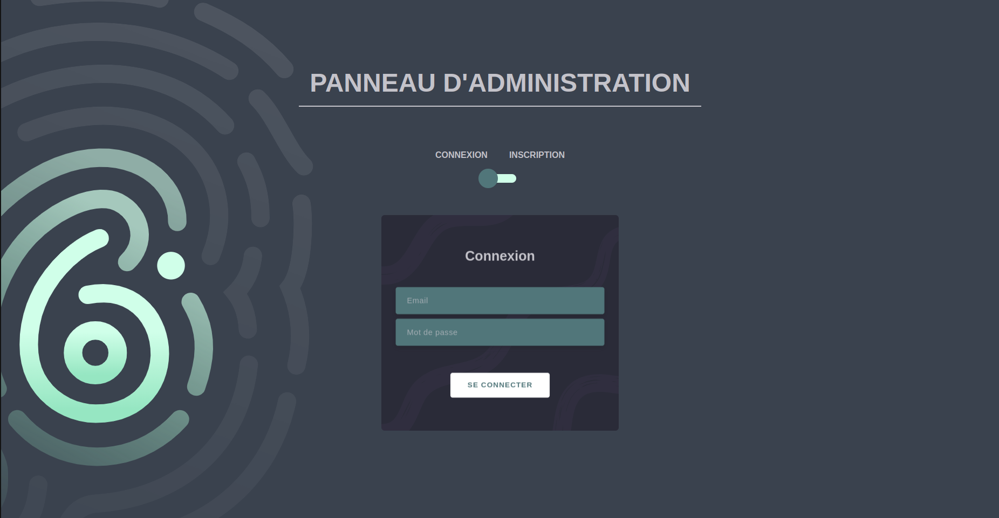
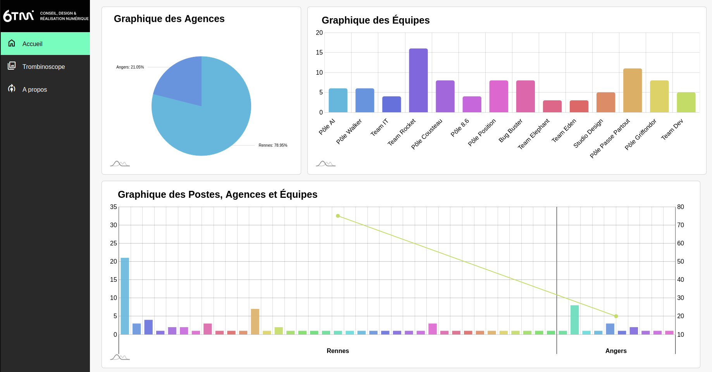
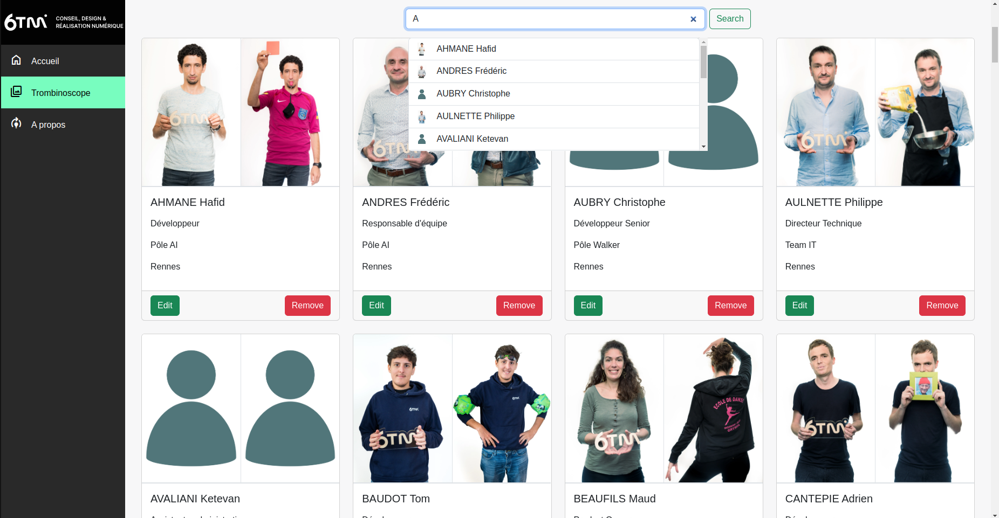
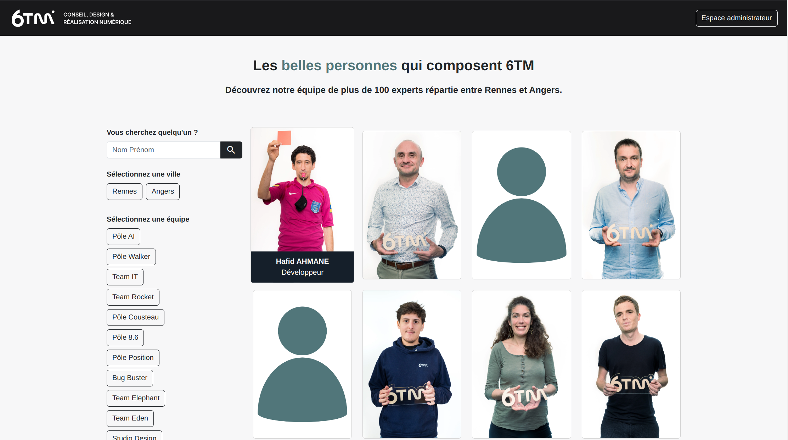
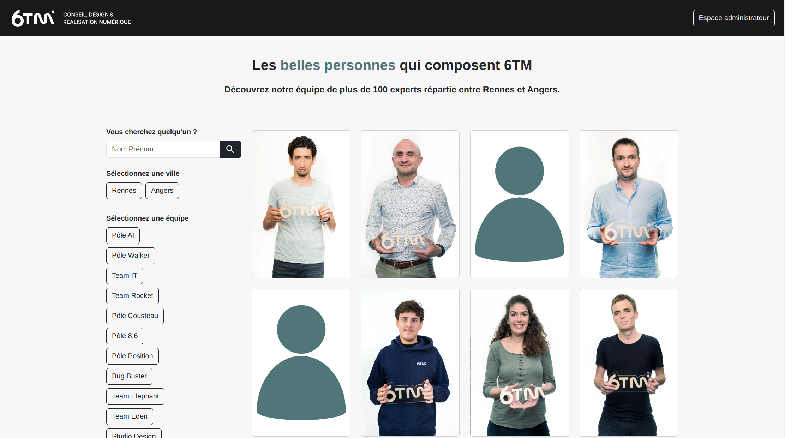

# Hackathon 6TM


## Description
This is a hackathon organized by [Epitech](https://www.epitech.eu/) and [6TM](https://www.6tm.com/) between the **15/02/2024 - 19/02/2024**. The goal is to create a staff photo directory like [Lucca](https://www.lucca.fr/societe/equipe), using [Symfony](https://symfony.com/) for the backend and our group decided to use [Vue](https://vuejs.org/) for the frontend.

## Requirements
- [Docker](https://docs.docker.com/engine/install/)

# BackOffice



<br>
<br>
<br>

# Trombinoscope


<br>
<br>
<br>

## Getting started 🚀
### Config your environnement and fill with your db data, ...
```bash
cp backend/.env.dist backend/.env
```
### Run project
```bash
./setup.sh --init
```

## Developers:

| [<br><sub>Mohammed JBILOU</sub>](https://github.com/Molaryy) | [<br><sub>Quentin BOLLORE</sub>](https://github.com/quentinbol) | [<br><sub>Tom LEFOIX</sub>](https://github.com/tlmx25) | [<br><sub>Justine LOIZEL</sub>](https://github.com/justineloizel)
|:---:|:---:|:---:|:---:|
